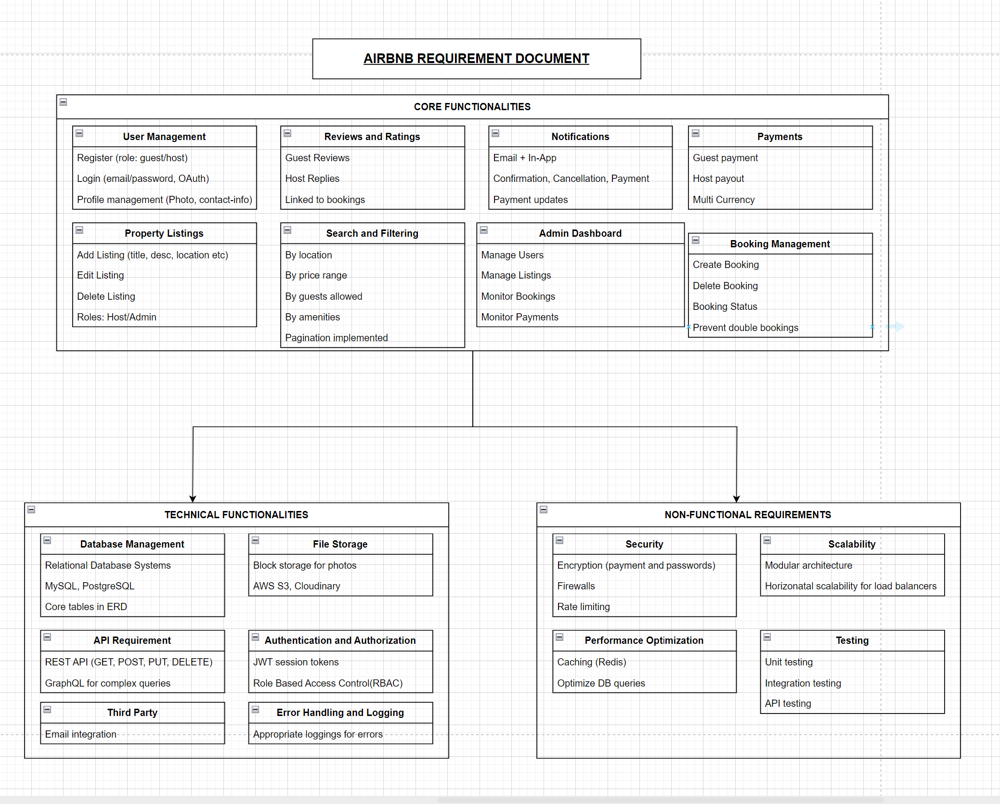

# Airbnb Clone – Features and Functionalities

This document outlines the **core**, **technical**, and **non-functional** requirements of the Airbnb Clone backend. The backend is designed to support key operations such as user management, property listings, booking, reviews, notifications, and payment processing.

---

## 🧩 Visual Overview

The diagram below provides a visual breakdown of all backend features required for this project:

---

## 🔑 Core Functionalities

- **User Management**  
  - Registration (guest/host)  
  - Login (email/password, OAuth)  
  - Profile updates (photo, contact-info)  

- **Property Listings**  
  - Create, edit, delete listings  
  - Manage property details and availability  

- **Search & Filtering**  
  - Filter by location, price, guest count, amenities  
  - Pagination for results  

- **Booking Management**  
  - Create/cancel bookings  
  - Track booking status  
  - Prevent double bookings  

- **Payment System**  
  - Handle payments via Stripe/PayPal  
  - Support multi-currency  
  - Automate host payouts  

- **Reviews & Ratings**  
  - Guest reviews  
  - Host replies  
  - Reviews linked to bookings  

- **Notifications**  
  - Email + In-app notifications  
  - Updates for booking, cancellation, and payments  

- **Admin Dashboard**  
  - Manage users, listings, bookings, and payments  

---

## ⚙️ Technical Requirements

- RESTful API with standard HTTP methods  
- PostgreSQL or MySQL database  
- JWT authentication + Role-based access control  
- File storage (S3, Cloudinary)  
- Error handling and logging  
- Optional: GraphQL for complex queries  

---

## 🚀 Non-Functional Requirements

- **Scalability**: Modular architecture, load balancing  
- **Security**: Encryption, firewalls, rate limiting  
- **Performance**: Caching (Redis), optimized queries  
- **Testing**: Unit, integration, and API testing  

---

## 🤖 AI Prompting Note

This README file was written through **prompting and collaboration with ChatGPT**, as part of my ongoing practice in AI-assisted development and documentation. The process helped reinforce clear thinking, structure, and technical articulation.

---

_This project was created as part of the ALX ProDev Backend Engineering Program._
