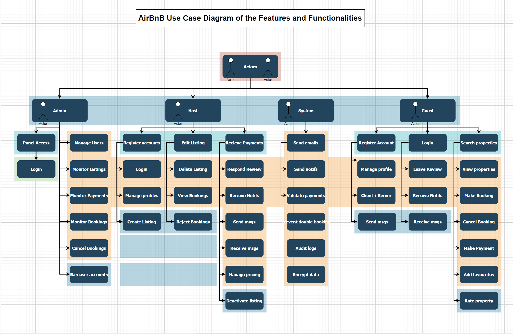

# 🏡 Airbnb Clone – Use Case Diagram

## 📌 Overview

This document provides a visual representation of the primary **actors** (users) and their **interactions** with the system for the backend of the Airbnb Clone. The use case diagram helps identify the core functionalities required and the responsibilities of each type of user.

---

## 🎭 Actors and Their Use Cases

### 👤 Guest

- Register / Login
- Search and filter properties
- Book a property
- View booking history
- Cancel bookings
- Make payments
- Leave reviews and ratings
- Add properties to favorites
- Message hosts

### 🏠 Host

- Register / Login
- Add/edit/delete property listings
- Manage availability and pricing
- View bookings for their properties
- Communicate with guests
- View earnings and reports
- Set cancellation policies

### 🛠️ Admin

- View/manage all users and listings
- Suspend or ban users
- Monitor payments and bookings
- Handle user disputes
- Approve/flag listings
- Send platform-wide notifications
- Assign or revoke user roles

---

## 🤖 System Responsibilities

- Prevent double bookings
- Send email and in-app notifications
- Validate and process secure payments
- Log all transactions and user activities
- Encrypt passwords and sensitive data

---

## 📁 Location

The use case diagram can be found in the `/use-case-diagram/` directory as:

- `use-case-diagram.png` (exported)
- 

---

## 🙌 Acknowledgments

This documentation was thoughtfully developed by me as part of the **ALX Airbnb Clone Project**.

💡 I practiced my **AI prompting skills** by working with **ChatGPT** to generate and structure the content of this README and use case details.

Thanks to OpenAI’s ChatGPT for the helpful assistance in translating system requirements into structured documentation and diagrams.

---
